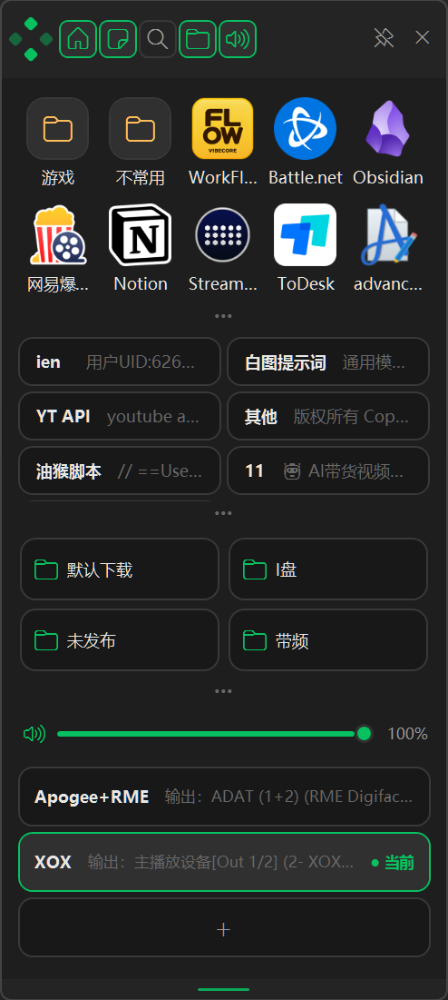
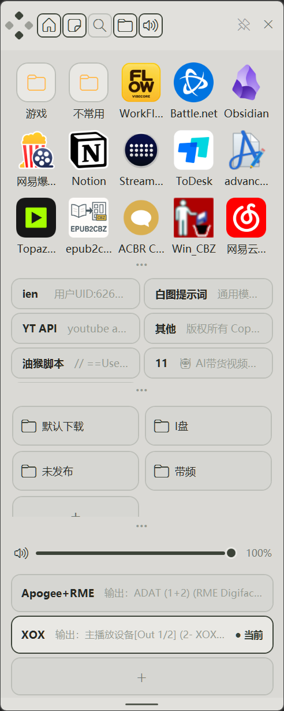

# Vibecore Hub

[中文](README.md) · [English](README_EN.md) · [日本語](README_JA.md)

Vibecore Hub is a native, modular desktop toolbar for Windows. It stays as a compact bar on your desktop and expands only the modules you choose.

<p align="center">
  
  &nbsp;&nbsp;
  
</p>

> Current version: 1.2.1 · Windows 10/11 · x64

Lightweight, portable, and customizable. It brings your frequently used apps, files, folders, notes, and audio devices together in one polished little window.

## Why I built Vibecore Hub

It started with Windows Sticky Notes. As my notes accumulated, finding the right piece of text became increasingly difficult. At the same time, desktop shortcuts kept piling up, while the files and folders needed for daily workflows were always a few searches away—neither visual nor convenient, and constantly interrupting my train of thought.

My computer also uses two audio interfaces for different purposes, making repeated input, output, and volume changes unnecessarily tedious. That led to the idea behind Vibecore Hub: a lightweight, polished, and modular desktop hub for shortcuts, notes, frequently used folders, and audio devices. Expand only what you need and complete common actions in a single step—so the tool adapts to your workflow, not the other way around.

## Current modules

- Shortcut Library: apps, files, folders, text snippets, and shortcut groups
- Notes: compact cards, separate viewer windows, and multi-column layouts
- Global Search: search shortcuts, directories, and notes
- Folder Directory: open frequently used folders quickly
- Audio Switcher: save input/output presets and switch default playback and communication devices together
- Computer Profiles: keep separate data and window layouts for different computers

## Technical overview

- Native Windows WPF application
- .NET 8
- Native Core Audio integration
- Each feature lives in its own module and is registered through `IHubModule`
- No WebView or third-party runtime required

## Build locally

```powershell
dotnet restore desktop\VibecoreHub.Desktop.csproj -r win-x64
dotnet build desktop\VibecoreHub.Desktop.csproj -c Release -r win-x64
```

## Publish a portable build

```powershell
dotnet publish desktop\VibecoreHub.Desktop.csproj -c Release -r win-x64 --self-contained true -o "release\Vibecore Hub" -p:PublishReadyToRun=false
```

Application data is stored in the `data` folder beside the executable. This folder is excluded by `.gitignore`; do not include personal data in source commits.

## Download

Portable builds will be available on the [Releases](https://github.com/VibecoreStudio/Vibecore-Hub/releases) page. Extract the archive and run `VibecoreHub.exe`—no installation is required.

## Data and privacy

- Settings and content remain in the local `data` folder
- Nothing is uploaded; move the entire folder when switching computers
- No account or registration required

## Project status

Vibecore Hub is under active development. Issues, suggestions, and ideas for useful lightweight modules are welcome.

## License

Copyright © 2026 VibecoreStudio

This project is licensed under the [GNU General Public License v3.0](LICENSE) (`GPL-3.0-only`). You may use, study, modify, and distribute it. Distributed modified or derivative versions must continue to provide the corresponding source code under GPLv3.
